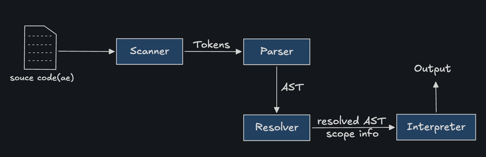

# Architecture

Aether is a **tree-walking interpreter**: source code is scanned into tokens, parsed into an AST, statically resolved, and then walked and executed directly — no bytecode or VM involved.

     
     <i>High Level Architecture</i>

## Pipeline Stages

### 1. Scanner (`src/scanner/`)
Converts raw source text into a flat stream of `Token`s (`scan.cpp`, `token.cpp`). Handles:
- Keywords, identifiers, literals (numbers, strings, booleans, `nil`)
- Operators and punctuation
- Line tracking for error reporting

### 2. Parser (`src/parser/`)
Consumes the token stream and builds an **Abstract Syntax Tree** (`parser.cpp`, `node_types.cpp`) using **recursive-descent** parsing, respecting operator precedence and associativity for expressions, and building statement nodes for control flow, functions, and classes.

### 3. Resolver (`src/resolver/`)
A static analysis pass (`resolver.cpp`) that walks the AST **before execution** to:
- Resolve variable references to the correct scope (local slot vs. global)
- Detect scoping errors early (e.g. self-referencing initializers)
- Annotate `this`/`super` bindings inside classes

### 4. Interpreter (`src/interpreter/`)
Walks the resolved AST and executes it directly:

- `interpreter.cpp` — execute statements and evaluate expressions
- `callable.cpp` — the `Callable` abstraction shared by user-defined functions, classes and native functions (like `clock()`)
- `aether_class.cpp` — class definitions, instances, method binding, and inheritance chains
- `runtime_value.cpp` — the tagged-union-like runtime value type representing numbers, strings, booleans, `nil`, callables, and instances

### 5. Core & Error Handling
- `src/core/` (`utils.cpp`) — shared helpers used across pipeline stages
- `error_handler.cpp` — centralizes error reporting so the scanner, parser, resolver, and interpreter all report consistent, human-readable diagnostics with line numbers

### 6. Entry Point
- `main.cpp` — wires the pipeline together, reads the generated `version.hpp` (produced by CMake from the `VERSION` file) for `version` output.

## Design Choices

- **Tree-walking, not bytecode.** Simpler to reason about and extend; trades some runtime performance for implementation clarity.

- **Resolve-then-interpret.** Doing scope resolution as a separate pass (rather than resolving lazily at runtime) keeps closures and shadowing correct without runtime lookup ambiguity.

- **Single runtime value type.** All Aether values funnel through one variant-like `RuntimeValue` type.

## Where to Start Reading the Code

If you're new to the codebase, the recommended reading order is:
1. `src/scanner/token.hpp` — see what a token looks like
2. `src/scanner/scan.cpp` — see how source text becomes tokens
3. `src/parser/node_types.cpp` — see the AST node shapes
4. `src/parser/parser.cpp` — see how tokens become an AST
5. `src/interpreter/interpreter.cpp` — see how the AST actually runs